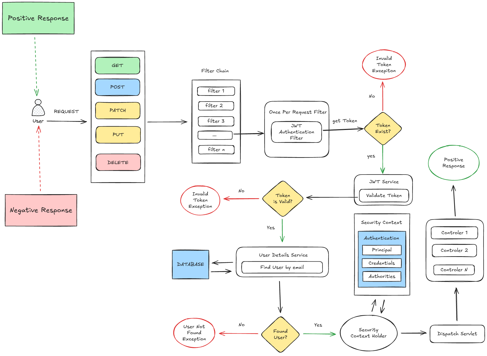

# Help with the project - And related links

## Extra Dependencies

1. [io.jsonwebtoken](https://github.com/jwtk/jjwt?tab=readme-ov-file#maven)
2. [springdoc-openapi](https://springdoc.org/#getting-started)
3.

## compose.yaml

### Postgres

- [How to use Postgres image](https://docs.docker.com/guides/java/develop/#dockerfile-for-development)
- [Use containers for Java development](https://docs.docker.com/guides/java/develop/)
- [How to set up a DockerFile](https://docs.docker.com/guides/java/develop/#dockerfile-for-development) for future references

### MailDev

- Test generated emails via [MailDev](https://github.com/maildev/maildev)
- [Configuring MailDev](https://github.com/maildev/maildev?tab=readme-ov-file#configure-your-project)

## Login process

1. register user, send activation code to email,
2. /activate-account using activation code. If expired, send another.
3. Now user is active. now /authenticate using email and password to generate activationCode JWT

Now you can log in using activationCode JWT.

## JPA Auditing

1. annotate `Application` with `@EnableJpaAuditing`
2. annotate the `Entity` with `@EntityListeners(AuditingEntityListener.class)`
3. now you can use `@CreatedDate` and `@LastModifiedDate`

## Security Diagram



## User Relationship


```java
User user = new User();
user.setUsername("joao");

Role role = new Role();
role.setName("ADMIN");

UserRoleId id = new UserRoleId();
id.setUserId(user.getId());
id.setRoleId(role.getId());

UserRole userRole = new UserRole();
userRole.setId(id);
userRole.setUser(user);
userRole.setRole(role);
userRole.setAssignedAt(Instant.now());

user.getUserRoles().add(userRole);
role.getUserRoles().add(userRole);
```

## Web Security

### `@EnableWebSecurity`

- Spring.docs - [Guide Securing a Web Application](https://spring.io/guides/gs/securing-web#initial)

### `@EnableMethodSecurity`

- Baeldung - [explanation](https://www.baeldung.com/spring-enablemethodsecurity)
- Spring.docs - [API Reference](https://docs.spring.io/spring-security/reference/servlet/authorization/method-security.html)
- Medium - [Securing Spring Applications with Method-Level Security](https://medium.com/@punnapavankumar9/securing-spring-applications-with-method-level-security-5fb70811179e)

## Spring Doc - Open API

## `@Async`

- Annotate `application` as `@EnableAsync`, now use `@Async` in the method
