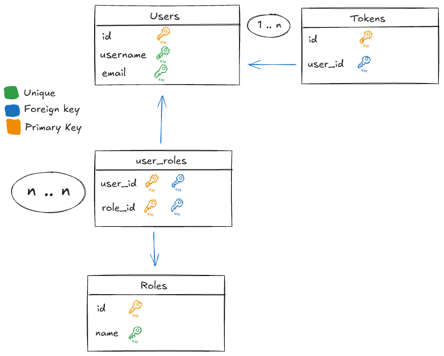

# Help with the project - And related links

## Extra Dependencies

1. [io.jsonwebtoken](https://github.com/jwtk/jjwt?tab=readme-ov-file#maven)
2. [springdoc-openapi](https://springdoc.org/#getting-started)
3.

## compose.yaml

[How to use Postgres image](https://docs.docker.com/guides/java/develop/#dockerfile-for-development)

[Use containers for Java development](https://docs.docker.com/guides/java/develop/)

[How to set up a DockerFile](https://docs.docker.com/guides/java/develop/#dockerfile-for-development) for future references

Test generated emails via [MailDev](https://github.com/maildev/maildev)
[Configuring MailDev](https://github.com/maildev/maildev?tab=readme-ov-file#configure-your-project)

## JPA Auditing

1. annotate `Application` with `@EnableJpaAuditing`
2. annotate the `Entity` with `@EntityListeners(AuditingEntityListener.class)`
3. now you can use `@CreatedDate` and `@LastModifiedDate`

## Security Diagram


## User RelationShip



```java
User user = new User();
user.setUsername("joao");

Role role = new Role();
role.setName("ADMIN");

UserRoleId id = new UserRoleId();
id.setUserId(user.getId());
id.setRoleId(role.getId());

UserRole userRole = new UserRole();
userRole.setId(id);
userRole.setUser(user);
userRole.setRole(role);
userRole.setAssignedAt(Instant.now());

user.getUserRoles().add(userRole);
role.getUserRoles().add(userRole);
```
